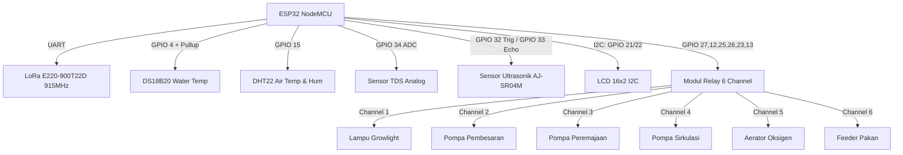
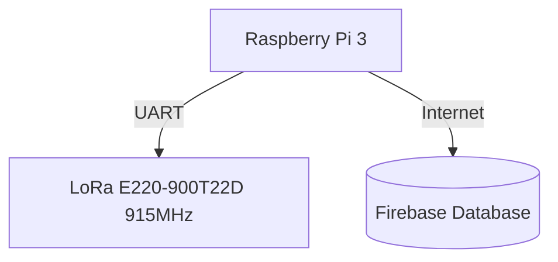

# Panduan Lengkap Wiring Kabel & Sensor: Sistem Akuaponik IoT

Panduan ini menjelaskan secara mendetail cara menghubungkan seluruh komponen elektronik, sensor, modul nirkabel LoRa, dan aktuator relai ke **ESP32** (Transmitter) dan **Raspberry Pi 3** (Receiver/Gateway).

---

## ⚠️ PENTING: Perhatian Keselamatan & Perangkat Keras
> [!CAUTION]
> 1. **Antena LoRa**: Jangan pernah menyalakan daya (*power up*) pada modul LoRa jika antenanya belum terpasang. Melakukannya dapat merusak chip transmitter akibat penumpukan energi RF balik.
> 2. **Tegangan LoRa**: Modul LoRa E220-900T22D mendukung rentang tegangan **2.3V - 5.5V**, sehingga aman dihubungkan ke 3.3V atau 5V. Logika pin I/O-nya kompatibel dengan level 3.3V dan 5V.
> 3. **Listrik AC 220V**: Bagian output relay yang terhubung ke Pompa, Lampu, atau Dinamo berurusan dengan tegangan tinggi listrik rumah tangga (220V AC). Pastikan steker listrik AC dicabut saat melakukan proses perkabelan relai.

---

## 📐 Ringkasan Skema Koneksi Sistem

### 1. Blok ESP32 (Transmitter)


### 2. Blok Raspberry Pi 3 (Receiver/Gateway)


---

## 🔌 Detail Wiring Sisi ESP32 (Transmitter Node)

### 1. Koneksi Modul LoRa E220-900T22D (915MHz) ke ESP32
Komunikasi menggunakan UART Serial.

| Pin LoRa E220 | Pin ESP32 | Warna Kabel (Disarankan) | Catatan |
| :--- | :--- | :--- | :--- |
| **VCC** | **3.3V / 5V** | Merah | Catu daya modul (2.3V - 5.5V). |
| **GND** | **GND** | Hitam | Ground bersama. |
| **TXD** | **GPIO 16 (RX2)** | Kuning | Hubungkan ke RX2 ESP32 (Pin 16). |
| **RXD** | **GPIO 17 (TX2)** | Hijau | Hubungkan ke TX2 ESP32 (Pin 17). |
| **AUX** | **GPIO 14** | Abu-abu | Status busy/idle pin. |
| **M0** | **GPIO 5** | Putih | Mode selection pin 0. |
| **M1** | **GPIO 2** | Biru | Mode selection pin 1. |

---

### 2. Koneksi Sensor-Sensor ke ESP32

#### A. Sensor Suhu Air (DS18B20 Waterproof)
DS18B20 menggunakan komunikasi 1-Wire. Anda **wajib** memasang resistor **4.7kΩ** sebagai pull-up antara kabel VCC dan kabel DATA.

* **Skema Resistor**:
  ```text
  [ VCC 3.3V ] ──────┬────── [ Kabel Merah DS18B20 ]
                     │
                  [Resistor 4.7kΩ]
                     │
  [ GPIO 4   ] ──────┴────── [ Kabel Kuning/Putih DS18B20 ]
  
  [ GND      ] ───────────── [ Kabel Hitam DS18B20 ]
  ```

| Pin Sensor DS18B20 | Koneksi / Pin ESP32 | Keterangan |
| :--- | :--- | :--- |
| **Merah (VCC)** | **3.3V** | Catu Daya |
| **Kuning/Putih (DATA)** | **GPIO 4** | Pin Data (Pasang pull-up resistor 4.7kΩ ke 3.3V) |
| **Hitam (GND)** | **GND** | Ground |

---

#### B. Sensor Kelembapan & Suhu Udara (DHT11 / DHT22)
Jika Anda menggunakan modul DHT yang sudah berada di board (memiliki 3 kaki), resistor pull-up biasanya sudah tertanam. Jika menggunakan sensor DHT berwujud komponen biru/putih 4 kaki kosong, tambahkan resistor 10kΩ antara VCC dan DATA.

| Pin Modul DHT22/11 | Pin ESP32 | Keterangan |
| :--- | :--- | :--- |
| **VCC (+)** | **3.3V atau 5V** | Sesuai spesifikasi modul DHT Anda. |
| **DATA (Out / S)** | **GPIO 15** | Pin Input Data digital. |
| **GND (-)** | **GND** | Ground |

---

#### C. Sensor TDS Air Analog
Sensor TDS analog memiliki modul konverter (board kecil). Elektroda probe TDS disambungkan ke konektor pada modul konverter tersebut, kemudian modul konverter disambungkan ke ESP32.

| Pin Modul Konverter TDS | Pin ESP32 | Keterangan |
| :--- | :--- | :--- |
| **VCC** | **5V (VIN)** | Board konverter TDS memerlukan 5V agar pembacaan ADC lebih stabil. |
| **GND** | **GND** | Ground |
| **A0 (Analog Out)** | **GPIO 34** | Output Analog TDS (Terhubung ke ADC1_CH6). |

---

#### D. Sensor Ketinggian Air Ultrasonik Waterproof (AJ-SR04M)
Sensor **AJ-SR04M** adalah sensor jarak ultrasonik tahan air yang sangat ideal untuk memantau ketinggian air kolam secara kontinu dari atas permukaan air. Sensor ini beroperasi pada tegangan **5V** dan memiliki 4 pin.

> [!CAUTION]
> **PENTING: Proteksi Tegangan Pin Echo (5V -> 3.3V)**
> Karena sensor AJ-SR04M ditenagai oleh 5V, pin **Echo** akan mengeluarkan sinyal digital bertegangan 5V. Pin GPIO ESP32 **tidak toleran terhadap 5V** (maksimal 3.3V). Anda **wajib** menggunakan rangkaian pembagi tegangan (*voltage divider*) sederhana menggunakan dua resistor (misalnya **1kΩ** dan **2kΩ**) untuk menurunkan tegangan sinyal Echo menjadi ~3.3V sebelum dihubungkan ke ESP32.

* **Skema Rangkaian Pembagi Tegangan (Voltage Divider) untuk Echo Pin**:
  ```text
                      [ Resistor 1kΩ ]
    [ Pin Echo Sensor ] ─────[██████]─────┬───── [ GPIO 33 ESP32 ]
                                           │
                                        [Resistor]
                                        [  2kΩ   ]
                                        [██████]
                                           │
    [ Pin GND Sensor  ] ───────────────────┴───── [ GND ESP32 ]
  ```

* **Skema Koneksi Lengkap**:
  
  | Pin AJ-SR04M | Pin ESP32 | Warna Jumper | Keterangan |
  | :--- | :--- | :--- | :--- |
  | **5V** | **5V (VIN)** | Merah | Catu daya sensor (butuh 5V stabil). |
  | **Trig / RX** | **GPIO 32** | Kuning | Output Trigger dari ESP32 (Aman langsung terhubung). |
  | **Echo / TX** | **GPIO 33** | Hijau | Input Echo ke ESP32 (Wajib melalui pembagi tegangan 1kΩ & 2kΩ). |
  | **GND** | **GND** | Hitam | Ground bersama. |

---

### 3. Koneksi Layar LCD 16x2 I2C ke ESP32
Layar LCD menggunakan komunikasi I2C (hanya memerlukan 4 kabel). Model 16x2 memiliki 16 kolom dan 2 baris data, dengan adapter backpack I2C yang sudah terpasang di bagian belakangnya.

| Pin LCD I2C (Backpack) | Pin ESP32 | Keterangan |
| :--- | :--- | :--- |
| **VCC** | **5V (VIN)** | Layar LCD memerlukan 5V agar tampilan karakter kontras dan backlight menyala terang. |
| **GND** | **GND** | Ground bersama. |
| **SDA** | **GPIO 21** | Jalur Data komunikasi I2C. |
| **SCL** | **GPIO 22** | Jalur Clock komunikasi I2C. |

---

### 4. Koneksi Modul Relay 6-Channel ke ESP32
Modul relay bertindak sebagai saklar elektronik untuk beban tegangan tinggi (220V AC). 

| Pin Modul Relay | Pin ESP32 | Keterangan |
| :--- | :--- | :--- |
| **VCC** | **5V (VIN)** | Catu daya koil relay (memerlukan 5V). |
| **GND** | **GND** | Ground bersama. |
| **IN1** | **GPIO 27** | Kontrol Lampu UV Growlight |
| **IN2** | **GPIO 12** | Kontrol Pompa Pembesaran |
| **IN3** | **GPIO 25** | Kontrol Pompa Peremajaan |
| **IN4** | **GPIO 26** | Kontrol Pompa Sirkulasi |
| **IN5** | **GPIO 23** | Kontrol Aerator Oksigen |
| **IN6** | **GPIO 13** | Kontrol Feeder Pakan |

> [!TIP]
> **Skema Pengkabelan Beban Listrik (AC 220V) pada Terminal Relay:**
> Setiap channel relay memiliki 3 terminal sekrup: **NO** (Normally Open), **COM** (Common), dan **NC** (Normally Closed).
> Hubungkan kabel listrik AC untuk Pompa/Lampu dengan skema berikut:
> 1. Potong salah satu jalur kabel power AC 220V (misal kabel fasa/setrum).
> 2. Hubungkan ujung kabel potong pertama ke terminal **COM** relay.
> 3. Hubungkan ujung kabel potong kedua ke terminal **NO** relay.
> 4. Saat relay dipicu (LOW/aktif), saklar akan menutup dan menyalakan perangkat.

---

## 🔌 Detail Wiring Sisi Raspberry Pi 3 (Receiver Node)

### Koneksi Modul LoRa E220-900T22D (915MHz) ke Raspberry Pi 3
Hubungkan pin modul LoRa ke pin header GPIO Raspberry Pi 3 menggunakan kabel jumper Female-to-Female sesuai pinout UART berikut.

| Pin LoRa E220 | Pin Fisik RPi 3 (Physical Pin #) | GPIO BCM (Sistem/Python) | GPIO WiringPi / Pi4J (Gambar) | Keterangan / Fungsi |
| :--- | :--- | :--- | :--- | :--- |
| **VCC** | **Pin 1, 2, atau 4** | - | - | Catu daya modul (3.3V atau 5.0V) |
| **GND** | **Pin 6, 9, 14, 20, 25, 30, 34, atau 39** | - | - | Ground bersama |
| **TXD** | **Pin 10** | **GPIO 15** | **GPIO 16 (RxD)** | UART RXD pada Raspberry Pi |
| **RXD** | **Pin 8** | **GPIO 14** | **GPIO 15 (TxD)** | UART TXD pada Raspberry Pi |
| **AUX** | **Pin 18** | **GPIO 24** | **GPIO 5** | Status indicator busy/idle |
| **M0** | **Pin 15** | **GPIO 22** | **GPIO 3** | Mode control pin 0 |
| **M1** | **Pin 16** | **GPIO 23** | **GPIO 4** | Mode control pin 1 |

> [!IMPORTANT]
> **Perbedaan Penomoran GPIO (BCM vs. WiringPi/Pi4J):**
> - **Penomoran BCM (Broadcom)** digunakan secara internal oleh pustaka Python seperti `RPi.GPIO` di dalam skrip [gateway.py](file:///c:/Users/User/.gemini/antigravity-ide/scratch/aquaponics-system/raspberry_pi/gateway.py).
> - **Penomoran WiringPi / Pi4J** adalah penomoran yang tertera pada diagram pinout yang Anda berikan (label besar di kolom kiri/kanan seperti GPIO 3, GPIO 4, dll.).
> - Selalu rujuk **Pin Fisik RPi 3 (Physical Pin #)** di tengah diagram untuk menghindari salah koneksi kabel fisik.

---

## 🔌 Alternatif: Detail Wiring Sisi Arduino Uno (Transmitter Node)

Jika Anda ingin menggunakan **Arduino Uno** sebagai transmitter pengganti ESP32, silakan ikuti pemetaan pinout berikut:

### 1. Koneksi Modul LoRa E220-900T22D ke Arduino Uno (UART via SoftwareSerial)
| Pin LoRa E220 | Pin Arduino Uno | Warna Jumper (Disarankan) | Catatan |
| :--- | :--- | :--- | :--- |
| **VCC** | **3.3V / 5V** | Merah | Catu daya modul. |
| **GND** | **GND** | Hitam | Ground bersama. |
| **TXD** | **Pin 11** | Kuning | SoftwareSerial RX Pin (Uno Pin 11). |
| **RXD** | **Pin 12** | Hijau | SoftwareSerial TX Pin (Uno Pin 12). |
| **AUX** | **Pin 10** | Abu-abu | Status indicator. |
| **M0** | **Pin 9** | Putih | Mode selection pin 0. |
| **M1** | **Pin 2** | Biru | Mode selection pin 1. |

### 2. Koneksi Sensor-Sensor ke Arduino Uno
- **Sensor Suhu Air (DS18B20)**: Hubungkan DATA ke **Pin 4** (Pasang resistor pull-up 4.7kΩ ke 5V/VCC).
- **Sensor Suhu & Hum Udara (DHT11)**: Hubungkan DATA ke **Pin 3**.
- **Sensor TDS Analog**: Hubungkan Analog Out ke **Pin A0** Arduino Uno.
- **Sensor Ultrasonik (AJ-SR04M)**: Hubungkan pin **Trig ke Pin 5** dan **Echo ke Pin 6**.
  > [!TIP]
  > **Bebas Rangkaian Pembagi Tegangan (Voltage Divider)**: Karena Arduino Uno beroperasi pada level logika 5V, Anda **tidak memerlukan** pembagi tegangan pada pin Echo AJ-SR04M. Pin Echo dapat langsung dihubungkan ke Pin 6.

### 3. Koneksi Modul Relay 4-Channel ke Arduino Uno
- **IN1 (Pompa)** -> **Pin 7**
- **IN2 (Feeder)** -> **Pin 8**
- **IN3 (Lampu)** -> **Pin A1** (dikonfigurasi sebagai output digital)
- **IN4 (Dinamo)** -> **Pin A2** (dikonfigurasi sebagai output digital)

### 4. Koneksi Layar LCD 20x4 I2C ke Arduino Uno
- **VCC** -> **5V**
- **GND** -> **GND**
- **SDA** -> **Pin A4** (Pin I2C default Uno)
- **SCL** -> **Pin A5** (Pin I2C default Uno)

---

## ⚡ Manajemen Daya & Catu Daya (Powering Guide)

Untuk memastikan sistem berjalan 24 jam nonstop tanpa gangguan ketidakstabilan atau reset mendadak (*brownout*):

1. **Raspberry Pi 3**:
   - Gunakan adaptor daya minimal **5V 2.5A** khusus Raspberry Pi yang berkualitas baik. Colokkan langsung ke port micro-USB RPi.
2. **ESP32 / Arduino Uno Node (Transmitter)**:
   - Gunakan adaptor charger smartphone USB **5V 2A** berkualitas tinggi. Hubungkan menggunakan kabel micro-USB ke port USB ESP32 atau port USB Arduino Uno.
   - **Penting**: Modul relay 4-channel menarik arus yang cukup besar saat semua relay aktif secara bersamaan. Jika mikrokontroler sering mengalami restart saat relay menyala, disarankan untuk memberi daya eksternal 5V pada modul relay dengan melepas jumper VCC-JDVCC pada modul relay dan menyambungkan power supply 5V eksternal ke pin JD-VCC dan GND relay.
 